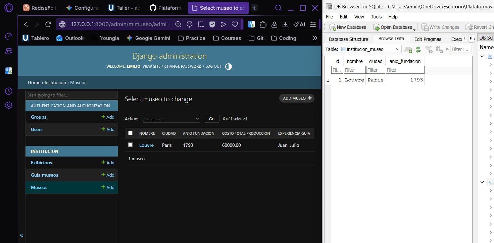
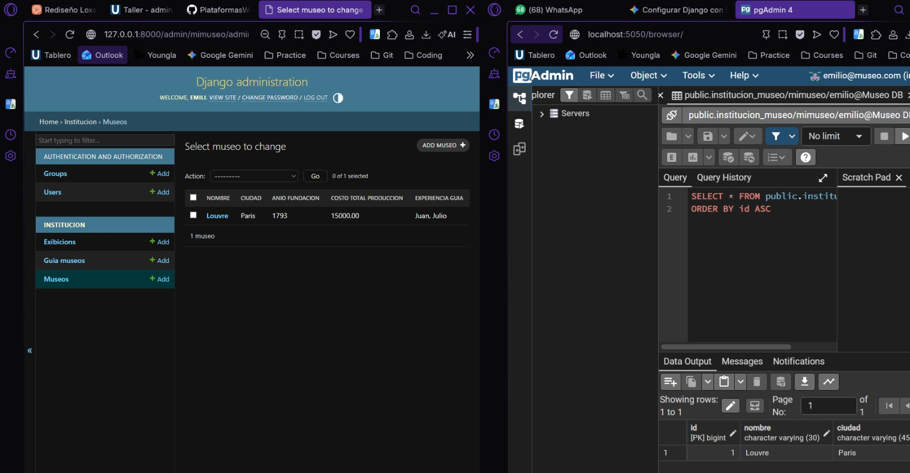

# taller_admin_django
# Taller: Administración de Django con Bases de Datos (SQLite y PostgreSQL)

**Estudiante:** Emilio José Peña Armijos  
**Institución:** Universidad Técnica Particular de Loja (UTPL)  
**Materia:** Plataformas Web  

---

## 📝 Descripción del Proyecto
Este proyecto consiste en el desarrollo y configuración de un sistema de gestión de patrimonio e instituciones utilizando el framework **Django**. A lo largo del taller, se implementó el modelo de datos para la gestión de un **Museo** y sus **Guías**, y se configuró el proyecto para interactuar con dos motores de bases de datos distintos: entornos de desarrollo local con SQLite y entornos contenedorizados mediante Docker con PostgreSQL y PgAdmin.

---

## 🛠️ Requisitos e Instalación

### 1. Clonar el repositorio y preparar el entorno
```markdown
    # Instalar las dependencias...
    pip install django psycopg2-binary
```
evidencias 

